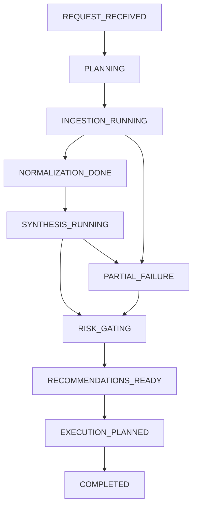

# Restaurant IQ 多 Agent Orchestration 架构设计（中文版）

- 文档生成时间：2026-02-27 22:45:00 PST
- 适用对象：负责后端架构、AI Agent、数据接入、执行引擎的新研发同学
- 目标：在现有 `Next.js + TypeScript + Clerk + Mock/Live API` 架构基础上，将当前“单次分析函数”升级为“可编排、可解释、可扩展、可执行、可回滚”的多 Agent orchestration 后端

---

## 1. 设计背景

当前项目已经具备以下基础：

- `Analysis` 页面可接收手动上传的运营数据
- `Agent A / B / C / D` 已有初步语义分工
- `Social Radar` 已可聚合部分社媒/评论信号
- `Dashboard` 已能展示分析结果与执行建议
- `Execution` 已有预览、滑动确认、执行、回滚倒计时的交互基础

但当前后端分析链路本质上仍然是：

1. 收集少量输入
2. 拼接 fallback 推荐
3. 如有 `OPENAI_API_KEY` 则调用一次模型综合输出

这套实现可以演示，但不适合作为真正的多 Agent orchestration 核心，主要短板如下：

### 1.1 当前实现的核心短板

1. **没有显式任务编排层**
- 当前 `runRestaurantMultiAgentAnalysis()` 是单函数串行逻辑
- 没有 planner / supervisor / retry / gating
- 不能控制各 Agent 的优先级、并发策略、重试策略和预算

2. **Agent 输出没有标准化证据结构**
- 现在只有 `summary / recommendations / agentSignals`
- 缺少 `evidence`, `confidence`, `freshness`, `source_id`, `conflict` 等字段
- 后续很难做解释性、审计和回放

3. **缺少状态机与阶段性产物**
- 没有 `ingestion -> normalization -> synthesis -> policy -> execution plan` 的状态流
- 用户和研发都无法知道当前卡在哪一步

4. **没有 orchestration 级别的风控层**
- 执行风险目前更多停留在前端按钮交互层
- 需要把风险判断前移到 recommendation planning 阶段

5. **缺少长期记忆和工作区上下文**
- 当前分析更像单轮请求
- 没有“本店历史趋势”“历史执行结果”“失败经验”“餐厅画像基线”这种 memory

6. **工具调用与业务任务绑定不够清晰**
- 外部数据接入、解析、分析、执行都混在一起
- 不利于未来接 POS / 外卖 / Google Business / Yelp Partner / Meta Webhooks

---

## 2. 设计目标

这套新的 orchestration 框架必须满足：

1. **可编排**
- 支持任务拆解、并发执行、阶段控制、失败回退

2. **可解释**
- 每条建议都能追溯到 Agent A/B/C 的证据来源

3. **可执行**
- 分析结果天然产出执行计划，而不是只产出文案

4. **可风控**
- 在执行前由风险 Agent / Policy Gate 做约束

5. **可回滚**
- 与现有执行/回滚机制打通

6. **可扩展**
- 未来可以平滑接入：
  - POS / 外卖平台
  - Google Business
  - Yelp Partner
  - Meta Graph
  - 天气 / 宏观 / 政府 / USDA / News / Citizen 等

7. **兼容当前项目**
- 不能脱离现有 `Next.js App Router` 结构另起炉灶
- 要优先兼容当前页面：
  - `/analysis`
  - `/dashboard`
  - `/social-radar`
  - `/settings`

---

## 3. 总体架构：从“单函数分析”升级为“分层 orchestration”

建议将后端多 Agent 系统拆成两层：

### 3.1 控制层（Control Plane）
负责 orchestration、状态、调度、风控。

核心组件：

1. **Planner / Orchestrator**
- 解析当前分析目标
- 决定调用哪些 Agent
- 决定并发/串行顺序
- 生成本次 `analysis_run`

2. **Supervisor**
- 监控各 Agent 执行状态
- 负责重试、降级、超时处理
- 负责 partial success 合并

3. **Policy Gate / Risk Gate**
- 对建议进行执行风险判断
- 输出：是否自动执行、是否强制二次确认、是否禁止执行

4. **Execution Planner**
- 把 recommendation 转成执行计划
- 产出 `execution_plan`, `rollback_plan`, `approval_requirement`

5. **State Store**
- 保存每次 orchestration 的中间态和最终态
- 支持调试、回放、对账、前端展示

### 3.2 数据层（Data Plane）
负责接入、清洗、结构化、证据化。

核心组件：

1. **Ingestion Adapters**
- POS / 外卖 / 文件上传 / 社媒 / 宏观 API 接入器

2. **Normalization Layer**
- 将不同来源统一成结构化信号

3. **Evidence Store**
- 保存本次分析所依赖的原始证据摘要

4. **Feature Builder**
- 将结构化信号转成可分析特征
- 提供给 Agent D / 风险评估 / 执行计划使用

---

## 4. 推荐的 Agent 体系

保留你定义的四个核心业务 Agent，但在其外层增加 orchestration 元 Agent。

### 4.1 核心业务 Agent

#### Agent A：运营数据监控 Agent（餐厅内）
职责：
- 清洗手动上传文件
- 清洗 POS / 外卖 / 排班 / 库存 / 采购数据
- 做字段归一、缺失值处理、分类映射、异常值标注
- 输出结构化运营快照

输入：
- POS 数据
- 外卖平台报表
- 排班数据
- 库存数据
- 手动上传文件

输出建议的数据结构：
```ts
type OpsSignal = {
  source: 'pos' | 'delivery' | 'staffing' | 'inventory' | 'manual_upload';
  entity: string;
  metric: string;
  value: number | string;
  unit?: string;
  period?: string;
  confidence: number;
  freshness: string;
  anomaly?: boolean;
  evidence_refs: string[];
}
```

#### Agent B：Social Media 监控 Agent
职责：
- 读取 Facebook / Instagram / Google Reviews / Yelp / TikTok / 小红书 等信号
- 归一化点赞、评论、互动、粉丝变化、负面评论主题、提及内容
- 输出社媒与口碑结构化信号

输出建议结构：
```ts
type SocialSignal = {
  platform: string;
  signal_type: 'engagement' | 'review' | 'mention' | 'follower_delta' | 'sentiment_cluster';
  metric: string;
  value: number | string;
  sentiment?: 'positive' | 'neutral' | 'negative' | 'mixed';
  confidence: number;
  freshness: string;
  evidence_refs: string[];
}
```

#### Agent C：宏观影响因子 Agent（外部）
职责：
- 整合天气、交通、封路、停电、节假日、事件、新闻、人口、CPI、食材价格等外部信号
- 将外部世界转成“对餐厅经营有意义”的结构化变量

输出建议结构：
```ts
type MacroSignal = {
  domain: 'weather' | 'traffic' | 'holiday' | 'event' | 'news' | 'population' | 'commodity';
  metric: string;
  value: number | string;
  direction?: 'up' | 'down' | 'stable';
  impact_window?: 'today' | 'this_week' | 'this_month';
  confidence: number;
  freshness: string;
  evidence_refs: string[];
}
```

#### Agent D：综合分析与预测 Agent
职责：
- 吸收 A/B/C 的结构化信号
- 进行综合分析、冲突消解、场景推演、优先级排序
- 生成 recommendation candidates
- 输出预测摘要和执行候选

输出建议结构升级为：
```ts
type RecommendationCandidate = {
  id: string;
  title: string;
  description: string;
  category: 'pricing' | 'marketing' | 'operations' | 'inventory' | 'social' | 'staffing';
  impact_score: number;
  urgency_level: 'low' | 'medium' | 'high';
  feasibility_score: number;
  confidence: number;
  risk_level: 'low' | 'medium' | 'high';
  rationale: string[];
  evidence_refs: string[];
  assumptions: string[];
  execution_params: Record<string, unknown>;
  rollback_available: boolean;
  expected_outcome: string;
}
```

### 4.2 Orchestration 元 Agent

这些不一定直接暴露给前端，但后端必须有。

#### Planner Agent
职责：
- 根据分析目标决定本次要调用哪些 Agent
- 例如：
  - 只有上传运营文件：重点调 A + D
  - 有社媒接入：重点调 B + D
  - 有天气事件：调 C + D
  - 有执行请求：调 Risk + Execution Planner

#### Supervisor Agent
职责：
- 管理运行生命周期
- 记录超时、重试、降级
- 支持 partial success

#### Policy / Risk Agent
职责：
- 对 recommendation candidate 做执行约束判断
- 结合 `/settings`：
  - 自动执行开关
  - 高风险需二次确认
  - 回滚窗口
  - 黑名单类目
  - 最大调价幅度

#### Execution Planner Agent
职责：
- 将 recommendation candidate 转成：
  - execution plan
  - approval requirement
  - rollback plan
  - audit trail

---

## 5. 推荐的运行时状态机

每一次分析都应该有一个 `analysis_run` 状态机。



### 阶段解释

1. `REQUEST_RECEIVED`
- 接收 restaurant config / uploaded docs / connected integrations

2. `PLANNING`
- Planner 判定本轮任务图

3. `INGESTION_RUNNING`
- A/B/C 并发拉数或解析

4. `NORMALIZATION_DONE`
- 将多源数据标准化为统一 signal schema

5. `SYNTHESIS_RUNNING`
- Agent D 综合分析和预测

6. `RISK_GATING`
- Policy Gate 过滤出可执行建议

7. `RECOMMENDATIONS_READY`
- 向前端返回可解释建议列表

8. `EXECUTION_PLANNED`
- 当用户触发执行预览时，生成更具体的执行计划

---

## 6. 与当前项目的落地映射

### 6.1 现有代码中的对应关系

当前已有：
- `/app/api/analysis/route.ts`
- `/lib/server/analysis-agent-runtime.ts`
- `/app/api/analysis/upload/route.ts`
- `/components/analysis/AnalysisClient.tsx`
- `/components/dashboard/DashboardClient.tsx`
- `/app/api/social/meta/route.ts`
- `/components/social/SocialRadarClient.tsx`

建议升级为：

```text
lib/server/orchestration/
  analysis-orchestrator.ts        # 主编排入口（替代现有单函数）
  run-state-store.ts              # 每次 run 的状态/阶段/结果
  planner.ts                      # Planner Agent / task graph 生成
  supervisor.ts                   # 重试、超时、降级、partial merge
  policy-gate.ts                  # 风险控制与执行约束
  execution-planner.ts            # 推荐 -> 执行计划
  evidence-store.ts               # 证据引用与摘要

lib/server/agents/
  agent-a-ops.ts                  # 运营数据监控 Agent
  agent-b-social.ts               # 社媒与口碑 Agent
  agent-c-macro.ts                # 宏观因子 Agent
  agent-d-synthesis.ts            # 综合分析与预测 Agent

lib/server/adapters/
  pos-adapter.ts
  delivery-adapter.ts
  upload-adapter.ts
  meta-adapter.ts
  google-business-adapter.ts
  yelp-public-adapter.ts
  yelp-partner-adapter.ts
  weather-adapter.ts
  macro-news-adapter.ts
```

### 6.2 API 层建议

当前 `/api/analysis` 不应继续直接调用“一个大函数”，而应改为：

```ts
POST /api/analysis
  -> createAnalysisRun()
  -> planner.plan(context)
  -> orchestrator.execute(runId, plan)
  -> return run result
```

并新增：

- `GET /api/analysis/runs/:id`
  - 返回本次分析 run 的完整状态

- `GET /api/analysis/runs/:id/agents`
  - 返回各 Agent 的结构化输出

- `GET /api/analysis/runs/:id/evidence`
  - 返回推荐所引用证据

- `POST /api/execution/plan`
  - 对某条 recommendation 生成执行计划与风险审查结果

---

## 7. 推荐的 Agent 间交互顺序

### 7.1 分析场景（用户点击“提交并分析”）

#### Step 1：Planner 生成任务图
输入：
- restaurant profile
- uploaded documents
- integration status
- social radar status
- settings policy

输出：
```ts
{
  runId,
  tasks: [
    { agent: 'A', mode: 'required' },
    { agent: 'B', mode: 'optional_if_connected' },
    { agent: 'C', mode: 'required' },
    { agent: 'D', mode: 'final_synthesis' }
  ]
}
```

#### Step 2：A/B/C 并发执行
- A：处理上传数据 / POS / 外卖 / 排班 / 库存
- B：处理社媒与口碑
- C：处理宏观影响因子

#### Step 3：Supervisor 归并结果
- 处理失败 Agent
- 记录 partial success
- 合并 normalized signals

#### Step 4：Agent D 综合分析
- 输入统一 signals
- 输出 candidate recommendations
- 每条建议都带 rationale + evidence_refs

#### Step 5：Policy Gate
- 检查：
  - 是否超出自动执行阈值
  - 是否命中黑名单类目
  - 是否必须人工二次确认
  - 是否支持回滚

#### Step 6：前端展示
- `Analysis` 显示：
  - Agent A/B/C/D 输出
  - recommendations
  - evidence
  - confidence
  - risk gate 结论

### 7.2 执行场景（用户点“执行预览”）

#### Step 1：Execution Planner
将 recommendation 转成：
- execution actions
- target systems
- rollback steps
- approval requirements

#### Step 2：Policy Gate 复核
- 结合当前设置和风险等级做二次判断

#### Step 3：返回执行预览
前端已有 `执行预览 + 滑动确认 + 回滚`，这里直接复用。

---

## 8. 推荐的数据模型升级

### 8.1 AnalysisRun
```ts
type AnalysisRun = {
  id: string;
  restaurantId?: string;
  status:
    | 'request_received'
    | 'planning'
    | 'ingestion_running'
    | 'normalization_done'
    | 'synthesis_running'
    | 'risk_gating'
    | 'recommendations_ready'
    | 'execution_planned'
    | 'completed'
    | 'partial_failure'
    | 'failed';
  createdAt: string;
  updatedAt: string;
  inputContext: Record<string, unknown>;
  agentRuns: AgentRun[];
  recommendations: RecommendationCandidate[];
  warnings: string[];
}
```

### 8.2 AgentRun
```ts
type AgentRun = {
  id: string;
  runId: string;
  agent: 'planner' | 'A' | 'B' | 'C' | 'D' | 'policy' | 'execution_planner';
  status: 'queued' | 'running' | 'completed' | 'partial' | 'failed';
  startedAt?: string;
  finishedAt?: string;
  inputSummary: string;
  outputSummary?: string;
  confidence?: number;
  warnings?: string[];
  evidenceRefs?: string[];
}
```

### 8.3 EvidenceRef
```ts
type EvidenceRef = {
  id: string;
  sourceType: 'upload' | 'meta' | 'google_business' | 'yelp' | 'weather' | 'news' | 'manual';
  sourceId: string;
  title: string;
  excerpt: string;
  freshness: string;
  confidence: number;
}
```

---

## 9. LLM 与 ReAct / Tool Calling 的推荐用法

你给的 Python 代码展示的是：
- LangChain
- ReAct Agent
- Tool-based orchestration

这个思路有价值，但直接照搬到当前项目并不合适，原因：

1. 当前主项目是 `Next.js + TypeScript`
2. 线上部署已经围绕 Node/PM2
3. 你需要的是“产品后端”，不是独立 Python demo

### 9.1 推荐方案

**不要把主 orchestration 核心放到 Python FastAPI 里作为第一步。**

更合理的做法：
- 保持主产品后端继续在 `Next.js Route Handlers + TypeScript` 中
- 用 OpenAI Responses API / tool-calling 做 Agent D 和 Planner/Policy 这类 LLM 节点
- 把外部工具调用作为明确的 adapter 层，而不是直接把所有 tool 都交给一个大 ReAct agent 乱调

### 9.2 推荐的 LLM 节点边界

适合用 LLM 的节点：
- Planner（任务规划）
- Agent D（综合分析与预测）
- Policy Gate（复杂风险说明）
- Social Reply Drafting（回复草拟）

不适合纯 LLM 的节点：
- 文件解析
- 数据清洗
- 权限校验
- token 刷新
- 执行状态机
- 回滚时钟
- webhook 校验

即：

> **数据接入和状态管理要 deterministic，LLM 只负责需要推理的地方。**

---

## 10. 推荐的执行风控架构

你现在前端已经有：
- 执行预览
- 滑动确认
- 回滚倒计时

后端应该补成：

### 10.1 Recommendation -> ExecutionPlan
```ts
type ExecutionPlan = {
  recommendationId: string;
  actions: Array<{
    system: 'meta' | 'google_business' | 'ubereats' | 'doordash' | 'manual_task';
    operation: string;
    params: Record<string, unknown>;
  }>;
  riskAssessment: {
    score: number;
    level: 'low' | 'medium' | 'high';
    requiresHumanConfirmation: boolean;
    blockedByPolicy: boolean;
    reasons: string[];
  };
  rollbackPlan?: {
    available: boolean;
    deadlineMinutes: number;
    actions: Array<Record<string, unknown>>;
  };
}
```

### 10.2 风控规则来源
直接绑定当前 `Settings`：
- 自动执行开关
- 高风险二次确认
- 回滚窗口
- 黑名单类目
- 最大价格调整幅度

这样前端“滑动确认”就不是单纯 UI，而是后端 policy 允许后的动作。

---

## 11. 分阶段落地建议

### Phase 1：把当前单函数改成状态化 orchestration
目标：不换产品形态，只升级后端结构。

要做：
- 新增 `analysis-orchestrator.ts`
- 新增 `AnalysisRun / AgentRun / EvidenceRef` 类型
- 将 `runRestaurantMultiAgentAnalysis()` 拆成：
  - planner
  - agentA
  - agentB
  - agentC
  - agentD
  - policyGate

### Phase 2：前端展示 Agent 结构化输出
目标：提高解释性与调试效率。

要做：
- `Analysis` 页面增加四个 Agent 输出卡片
- 显示 evidence refs / confidence / freshness

### Phase 3：把 recommendation 变成真正可执行的执行计划
目标：让执行模块从“通用 mock”升级为“真实 action plan”。

要做：
- 新增 `ExecutionPlan` API
- 执行预览读取真实 plan
- 回滚计划结构化返回

### Phase 4：引入长期记忆与工作区上下文
目标：让 Agent 不再是单轮分析器。

要做：
- 保存历史 runs
- 保存历史 recommendation outcomes
- 保存餐厅基线画像
- 支持趋势比较（本周 vs 上周 / 节假日 vs 平日）

### Phase 5：引入事件驱动
目标：从“用户点击分析”扩展到“自动巡检”。

要做：
- webhook / polling 触发 agent runs
- 例如：
  - 新评论到来
  - 天气预警
  - Google rating 下滑
  - 库存异常

---

## 12. 与你给的 Python / LangChain 代码的关系

你给的代码有几个可复用思想：

1. **tool 化的外部能力封装**
- Yelp / Weather / News / Reddit 等可以继续保留这种 adapter 思路

2. **Prompt 分角色**
- Planner / Data Agent / Analysis Agent 分角色 prompt 是对的

3. **ReAct 的“先想后调工具”模式**
- 对研究/解释型 Agent 有帮助

但不建议直接照搬的部分：

1. **一个总 Agent 控所有工具**
- 容易失控，成本高，调试难

2. **把 deterministic 工作交给 ReAct**
- 文件解析、权限校验、token 刷新不应由 LLM 决定

3. **以 Python FastAPI 为主服务**
- 会割裂当前主项目部署链路

### 最终建议

> 采用“TypeScript orchestrator + adapter layer + selective LLM nodes”的架构，
> 而不是“单个 LangChain ReAct 总控 Agent”。

---

## 13. 最终建议的项目后端形态

### 推荐后端分层

```text
app/api/
  analysis/
    route.ts
    upload/route.ts
    runs/[id]/route.ts
    runs/[id]/agents/route.ts
    runs/[id]/evidence/route.ts
  execution/
    route.ts
    plan/route.ts

lib/server/
  orchestration/
  agents/
  adapters/
  policy/
  storage/
```

### 关键原则

1. Adapter 层 deterministic
2. Agent 输出结构化
3. Orchestrator 管状态和任务图
4. Policy Gate 管风险和执行边界
5. Dashboard / Analysis / Social Radar 共用同一份 signal schema

---

## 14. 给新研发的结论

如果新研发要继续推进这个项目，多 Agent 后端的正确方向不是“继续往 `runRestaurantMultiAgentAnalysis()` 里塞逻辑”，而是：

1. 先把 orchestration 拆层
2. 再把 A/B/C/D 输出标准化
3. 再把 recommendation 接到真实 execution planning
4. 最后再引入 webhook / schedule / memory

换句话说：

> **下一阶段的核心不是“再加几个 Agent”，而是先把 Agent 之间的调度协议、状态机、证据结构和执行风控做对。**

